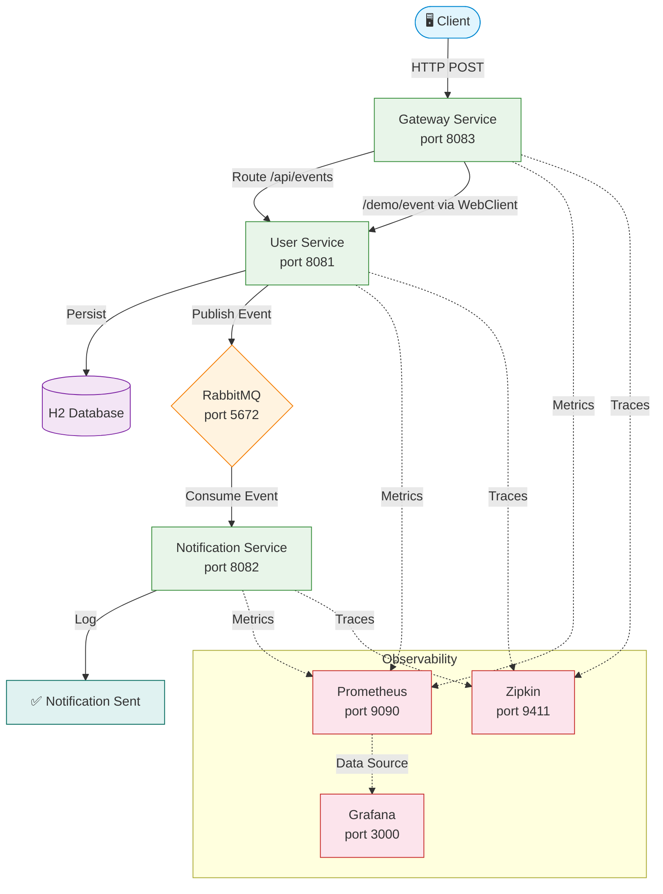

# NotifyFlow — Architecture Diagram

> Replace or supplement this with a PNG export at `diagrams/architecture.png` for the README image reference.

---

## Mermaid Diagram

Renderable on GitHub, GitLab, Notion, and any Mermaid-compatible viewer.



---

## Text Diagram

For environments that do not render Mermaid:

```
                      ┌──────────────────────────────────────────────┐
                      │            NotifyFlow Platform               │
                      └──────────────────────────────────────────────┘

  ┌────────┐       ┌───────────────┐      ┌──────────────┐       ┌──────────────┐
  │        │ HTTP  │               │ HTTP │              │ AMQP  │              │
  │ Client │──────▶│    Gateway    │─────▶│    User      │──────▶│   RabbitMQ   │
  │        │       │    Service    │      │   Service    │       │              │
  └────────┘       │   (8083)     │      │   (8081)    │       └──────┬───────┘
                   └───────────────┘      └──────┬───────┘              │
                                                 │                     │ AMQP
                                                 ▼                     ▼
                                          ┌──────────────┐   ┌──────────────────┐
                                          │ H2 Database  │   │  Notification    │
                                          │ (in-memory)  │   │  Service (8082)  │
                                          └──────────────┘   └──────────────────┘

  ┌──────────────────────────────────────────────────────────────────────────────┐
  │                         Observability Layer                                  │
  │                                                                              │
  │   Prometheus (9090) ──▶ Grafana (3000)         Zipkin (9411)                 │
  │   Scrapes /actuator/prometheus                  Collects distributed traces  │
  │   from all services                             across all services          │
  └──────────────────────────────────────────────────────────────────────────────┘
```

---

## Data Flow Summary

```
Step  Action                                    Protocol
────  ──────────────────────────────────────    ────────
 1    Client sends POST /demo/event             HTTP
 2    Gateway transforms → POST /api/events     HTTP
 3    User Service persists event to H2         JDBC
 4    User Service publishes to events.exchange AMQP
 5    RabbitMQ routes to events.queue           AMQP
 6    Notification Service consumes message     AMQP
 7    Notification Service logs delivery        Log
```

---

## How to Create a PNG

Export a PNG from the Mermaid diagram above using any of:

- [Mermaid Live Editor](https://mermaid.live) — paste the diagram, click export PNG
- [draw.io](https://app.diagrams.net) — for custom styled diagrams
- VS Code extension: **Markdown Preview Mermaid Support**

Save the output to `diagrams/architecture.png` and the README will display it automatically.
