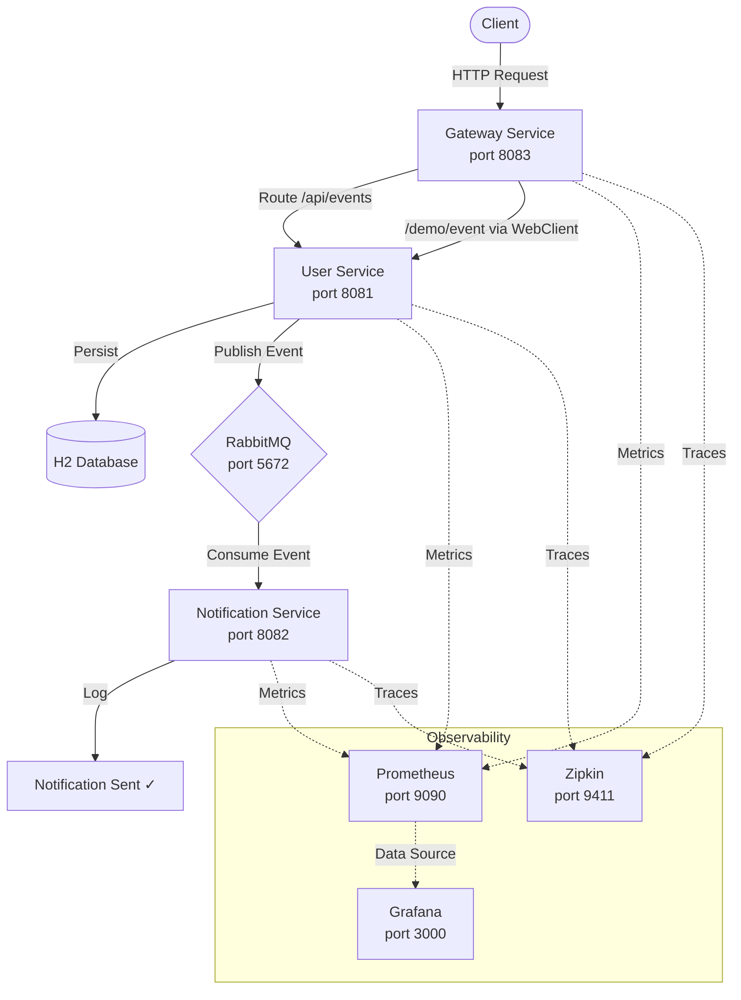

# NotifyFlow Architecture Diagram

## System Architecture



## Text Diagram

```
                            ┌──────────────────────────────────────────────┐
                            │               NotifyFlow System              │
                            └──────────────────────────────────────────────┘

    ┌────────┐         ┌──────────────┐         ┌──────────────┐         ┌──────────────┐
    │        │  HTTP   │              │  HTTP    │              │  AMQP   │              │
    │ Client │────────▶│   Gateway    │─────────▶│    User      │────────▶│   RabbitMQ   │
    │        │         │   Service    │         │   Service    │         │              │
    └────────┘         │  (8083)      │         │  (8081)      │         └──────┬───────┘
                       └──────────────┘         └──────┬───────┘                │
                                                       │                       │ AMQP
                                                       ▼                       ▼
                                                ┌──────────────┐    ┌──────────────────┐
                                                │  H2 Database │    │  Notification     │
                                                │  (in-memory) │    │  Service (8082)   │
                                                └──────────────┘    └──────────────────┘

    ┌──────────────────────────────────────────────────────────────────────────────────┐
    │                            Observability Layer                                   │
    │                                                                                  │
    │   Prometheus (9090) ──▶ Grafana (3000)       Zipkin (9411)                       │
    │   Scrapes /actuator/prometheus                Collects distributed traces         │
    │   from all services                           across all services                 │
    └──────────────────────────────────────────────────────────────────────────────────┘
```

## Data Flow

```
1. POST /demo/event ──▶ Gateway Service
2. Gateway transforms ──▶ POST /api/events ──▶ User Service
3. User Service persists event to H2
4. User Service publishes to events.exchange (routing key: events.key)
5. RabbitMQ routes to events.queue
6. Notification Service consumes from events.queue
7. Notification Service logs delivery
```
